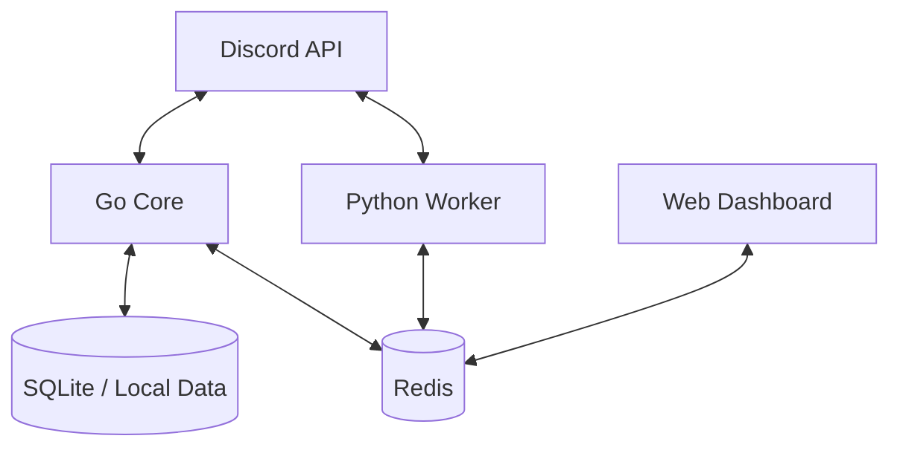

# Metricord Architecture

Metricord is a distributed Discord bot system designed for high performance and scalability. It consists of two main components working together: a **Go Core** and a **Python Worker**.

## System Overview

### 1. Go Core (`go-core/`)
The Go Core is the high-performance backbone of the bot. It handles real-time events and high-traffic commands.

- **Primary Language**: Go (Golang)
- **Key Responsibilities**:
    - Centralized Moderation (verification, automod).
    - Leveling System (XP tracking, rank commands).
    - Status Reporting.
    - Message Logging.
    - Utility Commands (`purge`, `echo`, `report`).
- **Data Storage**: Uses Redis for ephemeral state and SQLite/Local files for persistent data.

### 2. Python Worker (`bot/`)
The Python Worker handles complex logic, machine learning tasks, and integrations where Python's ecosystem is superior.

- **Primary Language**: Python 3.10+ (discord.py)
- **Key Responsibilities**:
    - **NSFW Detection**: ML-based avatar and image scanning.
    - **Pattern Analysis**: Behavioral pattern detection and alerts.
    - **Analytics Tracking**: Detailed server activity statistics.
    - **Background Tasks**: Member count synchronization, heartbeat updates.
- **Data Storage**: Communicates via Redis and shared data directories.

### 3. Shared Infrastructure
- **Redis**: Serves as a message bus and state store for both components.
    - `presence:online:<guild_id>`: Tracks online members.
    - `bot:heartbeat`: Monitors bot health.
    - `bot:lock:*`: Distributed locking to prevent multiple primary instances.
- **Docker**: The entire system is containerized for easy deployment (see `docker-compose.yml`).
- **Web Dashboard**: An optional module for visual management.

## Component Interaction

While both components connect to Discord directly, they coordinate through Redis. For example:
1. The **Python Worker** periodically syncs member statistics to Redis.
2. The **Go Core** or the **Dashboard** reads these statistics to display them to users.
3. Both components use distributed locks in Redis to ensure they don't step on each other's toes during critical operations.

## Directory Structure

- `go-core/`: Source code for the Go component.
- `bot/`: Source code for the Python worker.
- `shared/`: Shared Python utilities and clients.
- `config/`: Configuration files and templates.
- `scripts/`: Maintenance and helper scripts.
- `web/`: Web dashboard frontend and backend.
